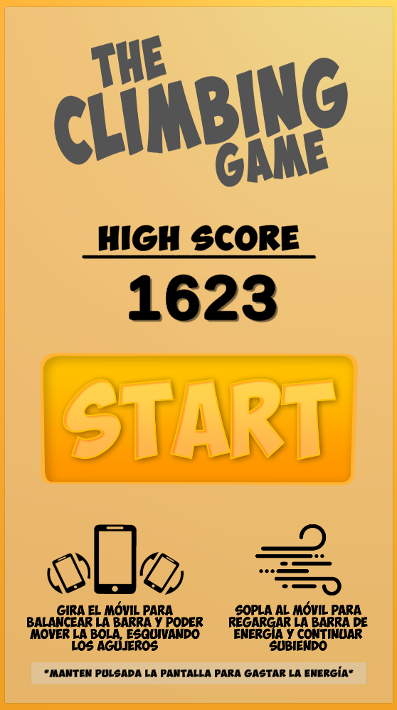
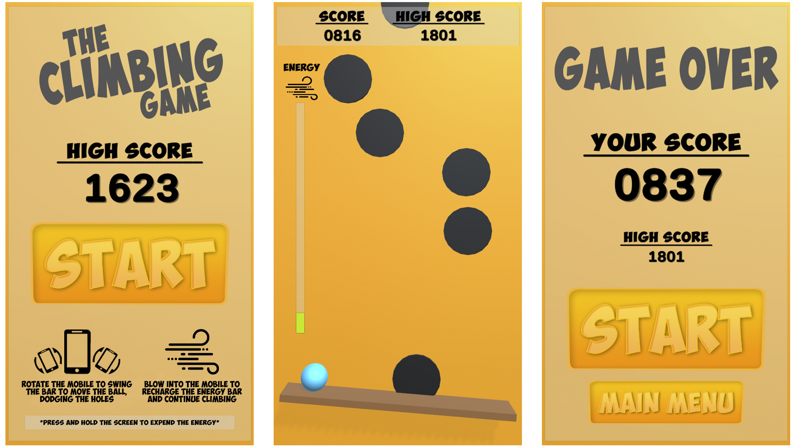
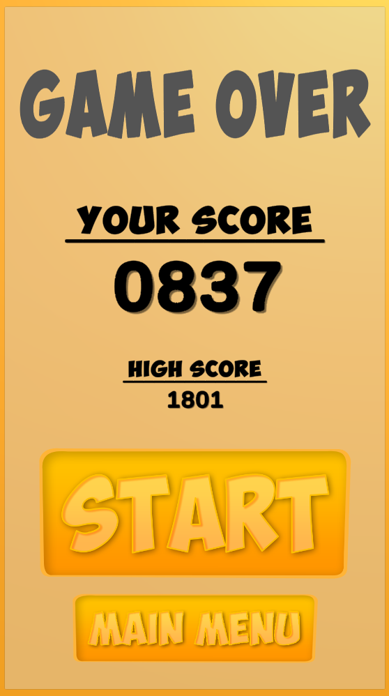

# The Climbing Game
Project for the Development of applications for mobile devices subject, of the Degree in Video Game Design and Development at the Rey Juan Carlos University (Create an Android videogame with Unity)

The game has been created in 48 hours, it had to make use of unique mechanics of Android devices, so it implements the use of the microphone to detect blows, and the use of the accelerometer for movement

It has a random generation of holes in a circular area with a creation delay to ensure, as far as possible, that there is no overlapping of holes

A scoring system has also been implemented that increases as we progress, this score is stored as a high score from game to game via data persistence

